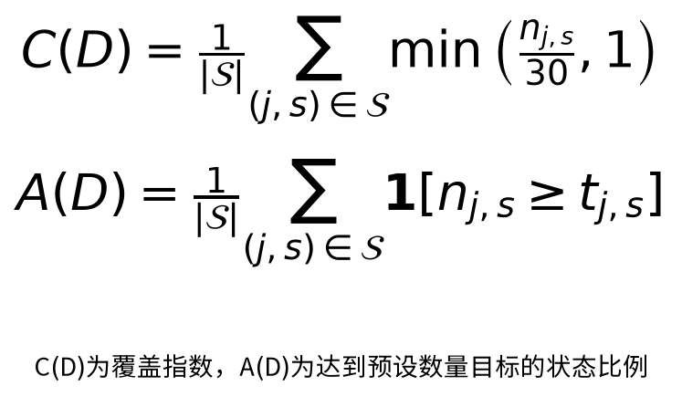
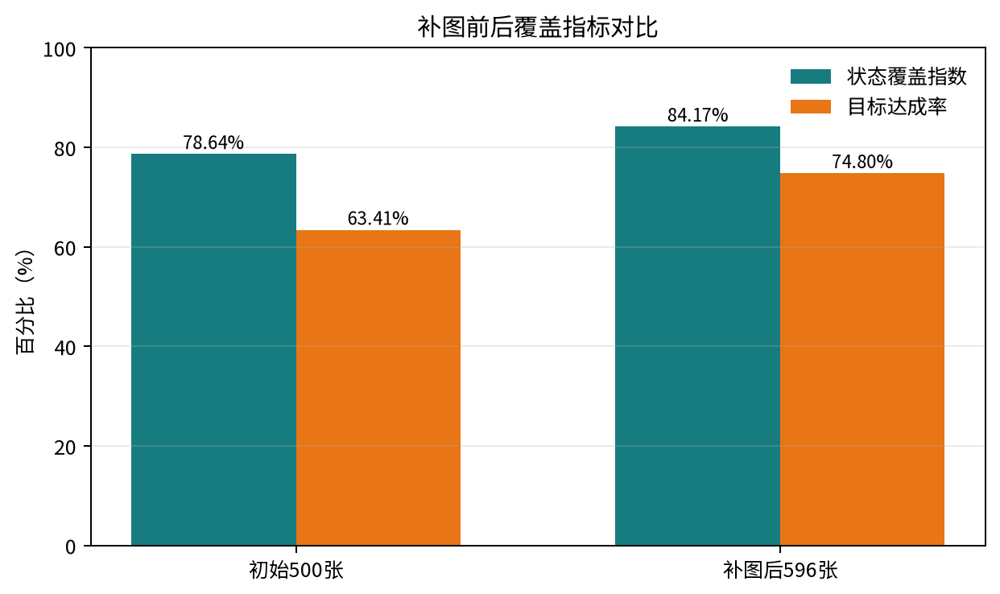
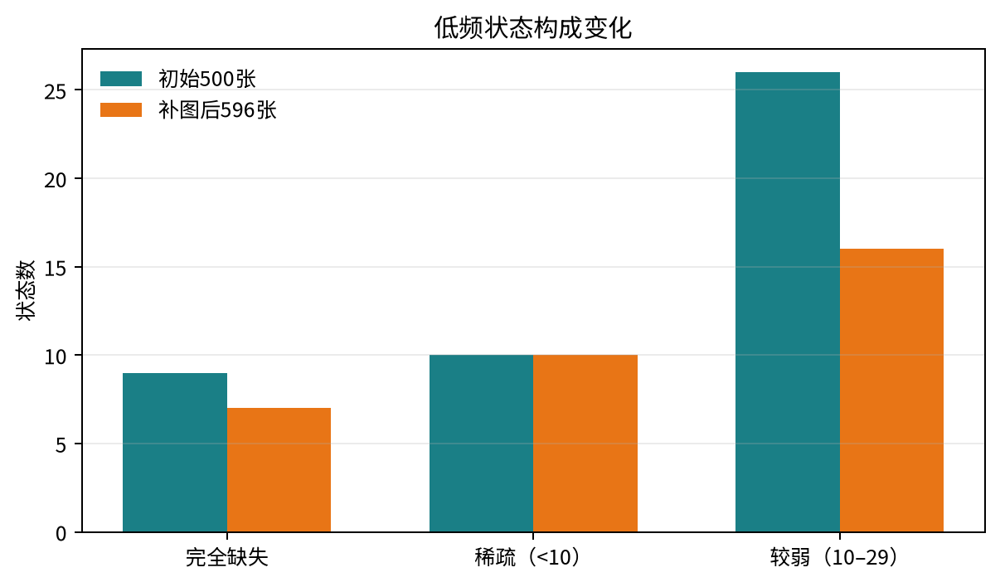
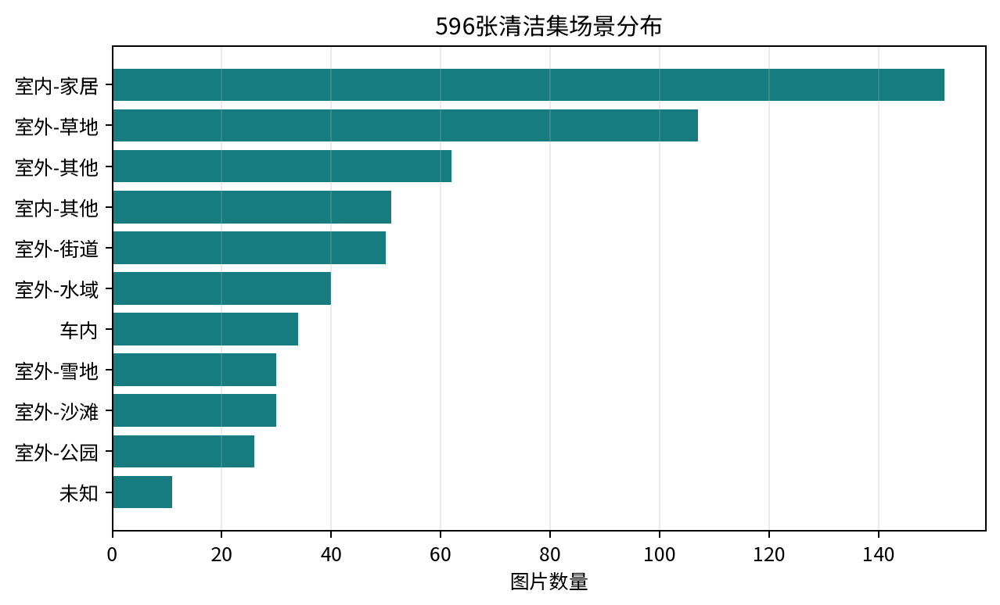
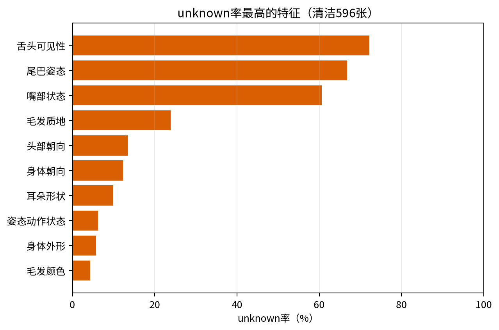

# 缺口驱动的视觉状态覆盖数据集构建方法：犬类图像案例研究

**摘要**

面向视觉识别的数据集质量不能仅由类别数量和图像规模衡量，同一类别内部的视觉状态分布同样决定测试覆盖范围。本文提出一种以视觉状态为对象的数据集构建流程：对固定目标实例进行结构化属性标注，使用有限枚举和严格校验保证结果可计算；在初始数据上识别缺失和低频状态；再从候选池中选择能够覆盖这些状态的补充样本，并通过数据清洁、哈希和版本留存形成可审计发布集。以COCO犬类图像为案例，初始集含500张图像，候选池含400张图像。结构化标注涵盖毛发、头面部、身体与动作、遮挡与截断以及场景等23项视觉属性。最终选择100张补充图像，排除4张非真实犬表现形式后形成596张清洁数据集。以30张为覆盖阈值的状态覆盖指数由78.64%提高至84.17%；按预先定义的状态目标计算的目标达成率由63.41%提高至74.80%；两批数据的结构化输出严格成功率均为100%。结果仅支持当前候选池内的状态覆盖改善，不支持识别准确率提升或跨类别泛化结论。

**关键词：** 数据集构建；数据策展；视觉属性；视觉语言模型；长尾状态；犬类图像

## 1 引言

目标检测数据集通常提供类别和边界框，但类别内部的颜色、纹理、姿态、朝向、可见性和场景分布可能高度不均衡。若只报告“包含多少张犬类图像”，无法判断测试数据是否覆盖了具有诊断价值的长尾视觉状态。Visual Genome 将对象、属性、关系和区域描述作为结构化标注对象，为区域级视觉语义建模提供了基础（Krishna et al., 2017）。数据子集选择研究进一步表明，覆盖、代表性和多样性可以用于减少冗余（Kaushal et al., 2019）；Active Covering 将覆盖目标形式化为主动查询问题（Jiang and Rostamizadeh, 2021）；TALISMAN 针对稀有类别和数据切片进行目标化获取（Kothawade et al., 2022）。SELECT 则强调应在统一预算下比较数据策展策略（Feuer et al., 2024）。

本文不提出新的视觉编码器或主动学习理论，而是研究一个可复现的数据构建流程：能否将VLM结构化属性、严格质量控制和缺口驱动选图组织成一个可审计闭环。

本文贡献如下：

1. 定义一个固定目标、三视图输入和23项有限枚举视觉属性的犬类数据协议；
2. 建立原始响应、解析结果、非法值、人工修正和哈希可追溯的数据质量流程；
3. 以状态分布而非类别计数定义数据缺口，并在固定补图预算下进行候选选择；
4. 报告覆盖指数和目标达成率，同时明确其不等同于识别性能。

## 2 相关工作

### 2.1 结构化属性标注

Visual Genome在区域级别收集对象、属性和关系，目标是支持更完整的场景理解。本文采用相同的结构化属性思想，但将目标固定为一个COCO dog实例，属性集合采用冻结的有限枚举，以便进行逐状态统计和版本比较。

### 2.2 覆盖导向的数据选择

已有子集选择工作研究多样性、覆盖和代表性；Active Covering研究以最少查询覆盖正例；TALISMAN研究稀有切片的目标化采样。本文与这些工作共享“以覆盖或稀有状态指导样本获取”的问题背景，差异在于选择信号来自VLM提取的犬类视觉状态，而不是分类不确定性、嵌入距离或人工类别标签。

### 2.3 数据策展评价

SELECT说明数据策展方法需要在统一预算和明确基线下比较。本文当前只完成一个犬类案例和一种缺口驱动选择，因此将结果解释为流程可行性与覆盖改善，不声称优于随机或其他策展策略。

## 3 方法

图1展示从COCO初始集、固定A目标、三视图VLM标注、状态分布审计到缺口驱动补图和清洁发布的完整链路。每一步都产出可留存文件，因此后续统计不依赖模型重新解释图片。

### 3.1 数据协议

每张图像由COCO标注程序固定一个dog目标作为A目标。模型输入为原图、带A框标记图和未标记目标裁剪放大图。目标框、面积比例、中心位置和边界截断由程序计算；模型不得重新选择目标，也不得读取真实标签。

### 3.2 视觉属性体系

属性分为五组：毛发3项；头部和面部8项；身体与姿态动作6项；遮挡与截断5项；场景1项。所有单值属性使用有限枚举，多选部位使用数组。`unknown`表示无法判断，`other`表示可观察但无法归入既定细分类。眼睛、嘴部、尾巴和犬体可识别性具有显式依赖规则。

### 3.3 严格输出和质量控制

模型输出必须同时满足JSON结构、字段完整性、枚举或数组枚举、证据字段一一对应、目标身份一致和依赖规则。非法值不自动转换为`unknown`，原始响应单独保存。该设计将格式错误、未知状态和人工修正分开记录。

### 3.4 覆盖指标

令 $n_{j,s}$ 表示特征 $j$ 的状态 $s$ 在数据集中的计数，令 $\mathcal S$ 为排除`unknown`和`other`后的可评价状态集合。本文报告两个不同指标。

**状态覆盖指数**用于描述状态计数的饱和程度。公式中的30是单个状态的饱和阈值：达到30张后继续增加不会改变该状态的覆盖贡献。

它不是“达到目标的状态比例”，也不是识别准确率。

**目标达成率**用于报告预先定义的数量目标：

目标达成率的完整数学表达见图2；其中指示函数在状态计数达到其冻结目标时取1，否则取0。

其中，当初始计数少于10时 $t_{j,s}=10$，当初始计数为10至29时 $t_{j,s}=30$，其他状态的目标按30计。目标必须在补图选择前冻结，不能根据补图后的计数倒推。

### 3.5 缺口驱动的选择算法

初始集统计每个特征状态的计数，并将状态分为完全缺失（0）、稀疏（1–9）和较弱（10–29）。候选池先经过同一套v3.1协议标注，再按候选图片对缺口状态的增量覆盖进行评分。选择时采用分层贪心：每轮优先选择能覆盖最多未达标状态的图片，同时约束多犬、目标过小、人物共现、边界目标和小目标五类场景的配额，直到达到100张预算。该目标与加权覆盖问题具有相似结构；在不考虑场景配额的理想化设定下，可以参考单调子模覆盖的贪心分析。由于本文实际使用了场景配额和分层约束，本文不声称当前实现具有理论最优性或经典近似保证。每个选择决策都记录其命中的缺口状态与场景分层，使选图理由可回溯到具体状态，而不是依赖主观挑图。

### 3.6 质量控制与数据清洁

质量控制分为解析层、语义层和数据集层。解析层检查JSON可解析、字段齐全、枚举合法、证据字段一一对应；语义层执行部位依赖规则，例如眼睛不可见时不强行判断睁闭，严重遮挡或截断时犬体可识别性不能标为清晰；数据集层检查图像哈希、COCO目标框、三种输入图和协议哈希。任何失败都保留原始响应并单独计数，不把失败改写成unknown。最终清洁集只排除已确认的非真实犬表现形式，排除清单和原因单独保存。

## 4 实验设置

初始数据集包含500张COCO犬类图像，候选池包含400张图像。使用本地视觉语言模型进行23项属性标注，模型推理采用固定的三视图输入。初始数据用于缺口分析，候选池用于补图选择。选择预算为100张，并保持五类场景分层每类15至30张。初始集排除4张已确认的非真实犬表现形式后，保留496张；再加入候选池中选出的100张，得到596张清洁发布集。候选池其余图片仅作为未选候选，不进入最终发布集。排除清单、判定原因和图像哈希均单独保存。

表1 数据集数量核算

| 数据阶段 | 图片数 | 是否进入清洁发布集 |
|---|---:|---|
| 初始数据集 | 500 | 部分 |
| 初始集排除 | -4 | 否 |
| 候选池选入 | +100 | 是 |
| 最终清洁集 | 596 | 是 |

## 5 结果

所有图表均由本地CSV和`report.json`重新计算，不是手工绘图。覆盖指数的分母固定为123个可评价状态，`unknown`和`other`不进入分母；严格成功率只衡量JSON、字段、枚举、证据和依赖规则检查通过，不能解释为视觉属性语义准确率或dog识别准确率。

### 5.1 结构化标注成功率

表2 结构化响应协议通过情况

表1 结构化响应协议通过情况

| 数据 | 图片数 | 严格成功 | 失败 | 成功率 |
|---|---:|---:|---:|---:|
| 初始集 | 500 | 500 | 0 | 100% |
| 候选池 | 400 | 400 | 0 | 100% |
| 合计 | 900 | 900 | 0 | 100% |

### 5.2 补图前后覆盖

表3 补图前后覆盖指标对比

表2 补图前后覆盖指标对比

| 指标 | 初始500张 | 清洁596张 |
|---|---:|---:|
| 图像数量 | 500 | 596 |
| 状态覆盖指数 $C(D)$ | 78.64% | 84.17% |
| 目标达成率 $A(D)$ | 63.41% | 74.80% |
| 低频状态数 | 45 | 33 |
| 完全缺失状态数 | 9 | 7 |

100张补图使状态覆盖指数提高5.53个百分点，目标达成率提高11.39个百分点。剩余33个低频状态包括红色毛发、条纹或花斑图案、混合眼睛状态、夹尾、吠叫、多场景等。它们在当前候选池中没有足够样本，不能通过继续重复同一选择过程得到充分覆盖。

图3表明补图同时改善“计数饱和程度”和“达到预设目标的状态比例”，但两者提升幅度不同，说明部分状态虽然获得了新增样本，仍未达到30张饱和阈值。图4进一步显示完全缺失状态由9降至7，稀疏状态保持10，较弱状态由26降至16；因此补图主要减少了中低频状态，而不是宣称所有状态已经均衡。

### 5.3 场景状态

场景细分后，初始集包含室内其他47张、室外其他53张和室外水域36张。该结果说明`other`应表示有信息但缺少细分类，而不是将明确的室外图像标记为不确定。

### 5.4 unknown分布与可观测性

unknown不是统一的模型失败标签，而是“输入中没有足够证据判断该字段”的显式状态。清洁集unknown率最高的字段集中在尾巴姿态、舌头可见性、嘴部状态和眼睛状态等需要局部清晰度或特定视角的属性。图6将这些字段按unknown率排序，提示后续补图应优先补充近景、侧面和嘴部/尾部无遮挡样本，而不是盲目增加普通站立犬图片。

### 5.5 稳健性与可解释性检查

我们进行了三项不依赖模型自报的检查。第一，900张输入的严格协议成功率为100%，说明当前格式约束和断点重跑机制可执行。第二，覆盖指标由独立脚本从状态分布表计算，改变报告排序不会改变数值。第三，所有补图样本均带有选择分层和候选状态证据，可将覆盖变化追溯到选图决策。以上检查支持“流程可审计”，但不等价于“特征语义已经达到人工真值标准”。

## 6 讨论

实验支持以下有限结论：在固定犬类数据、固定属性协议和当前候选池内，缺口驱动选择提高了状态覆盖和预设目标达成率。该结论描述的是数据构建结果，不是模型识别性能。

当前结果不能支持以下主张：缺口驱动选择普遍优于随机选择；补图提高了dog识别准确率；596张的全部特征均为人工真值；该流程对其他类别具有泛化性。新增补图尚未运行独立分类VLM，因此不报告清洁596张的整体识别率。

从数据集使用角度看，当前版本适合作为“dog类别内部视觉状态覆盖测试集”或模型误差分析集，而不应被描述为犬种识别、身份识别或通用目标检测基准。若用于论文实验，建议将初始500张作为构建集，将清洁596张作为发布集，并额外保留一个未参与缺口分析的留出子集，用于检验补图是否改变模型在独立样本上的表现。这样可以避免以同一批图片同时定义特征、选择补图和报告性能所造成的信息泄漏。

补图收益也具有边际递减特征：当某状态接近30张时，再为该状态补图对覆盖指数的贡献趋近于零；相反，完全缺失状态虽然数量少，却决定了状态集合是否真正存在。因此下一轮选图应把“缺失状态优先级”和“可观测性”同时纳入，而不是只按图片数量扩充。

## 7 局限性与复现

主要限制包括：人工复核覆盖范围有限；VLM属性存在系统性偏差风险；选择策略缺少随机和分层随机对照；初始集参与了协议和缺口设计，不能作为完全独立留出集；场景和动作枚举仍可能需要跨类别适配；COCO图片的再分发许可需按原始条款核对。

所有结果均可由以下目录和脚本追溯：

- `configs/dog_feature_schema_v3_1.json`；
- `prompts/dog_feature_annotation_v3_1.txt`；
- `artifacts/dog500_features_v3_1_20260913`；
- `artifacts/dog_candidate400_features_v3_1_20260913`；
- `artifacts/dog_v3_1_supplement_selection_20260913`；
- `artifacts/dog_v3_1_combined_supplement_20260913_final`。

## 8 结论

本文给出了一套以视觉状态覆盖为目标的数据集构建流程。该流程将固定目标、VLM结构化标注、严格质量控制、低频状态分析和缺口驱动选图连接起来。在犬类案例中，900张图片均产生了严格通过协议的结构化特征响应；选择100张补图后，清洁596张数据集的状态覆盖指数由78.64%提高至84.17%，目标达成率由63.41%提高至74.80%。这些结果证明流程在当前案例中的可执行性和覆盖改善，但仍需要公平策展对照、双人一致性和独立分类验证，才能支持更强的研究结论。

## 参考文献

1. Krishna, R. et al. Visual Genome: Connecting Language and Vision Using Crowdsourced Dense Image Annotations. IJCV, 2017. https://link.springer.com/article/10.1007/s11263-016-0981-7
2. Kaushal, V. et al. Learning From Less Data: A Unified Data Subset Selection and Active Learning Framework for Computer Vision. arXiv:1901.01151, 2019. https://arxiv.org/abs/1901.01151
3. Jiang, H. and Rostamizadeh, A. Active Covering. ICML, PMLR 139, 2021. https://proceedings.mlr.press/v139/jiang21i.html
4. Kothawade, S. et al. TALISMAN: Targeted Active Learning for Object Detection with Rare Classes and Slices Using Submodular Mutual Information. ECCV, 2022. https://www.ecva.net/papers/eccv_2022/papers_ECCV/html/4820_ECCV_2022_paper.php
5. Feuer, B. et al. SELECT: A Large-Scale Benchmark of Data Curation Strategies for Image Classification. NeurIPS 2024. https://proceedings.neurips.cc/paper_files/paper/2024/hash/f6de5ed486b1802874fe9c70b50277e4-Abstract.html
